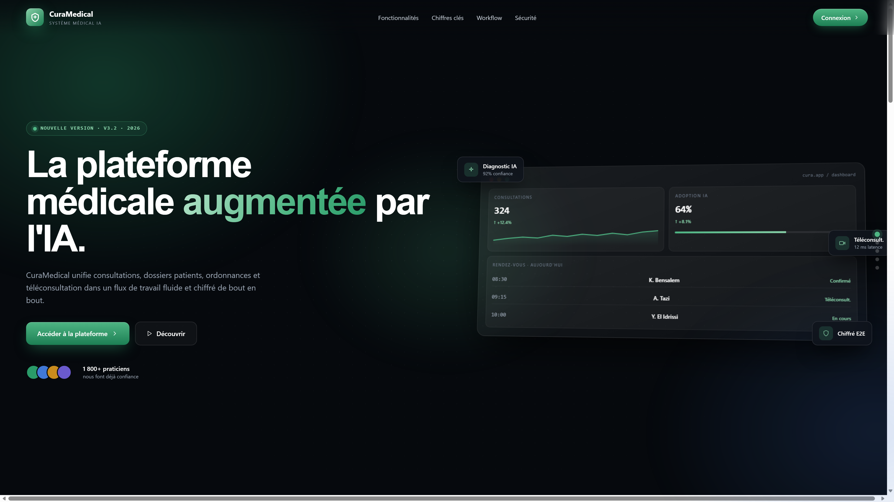
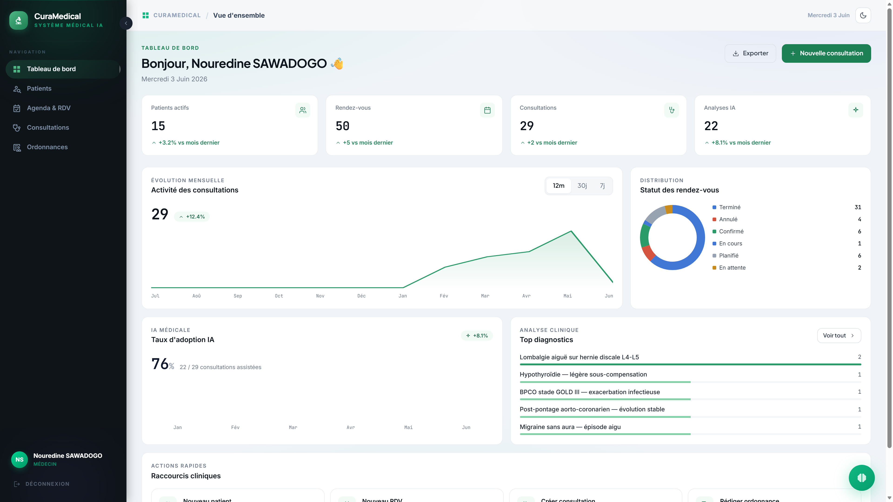
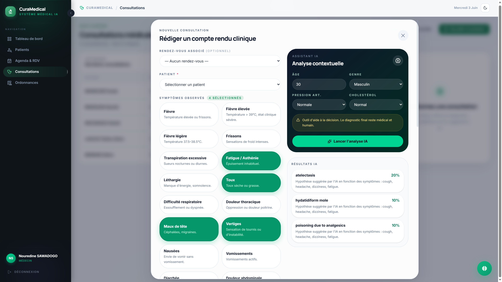
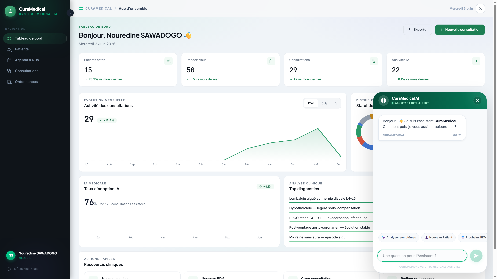
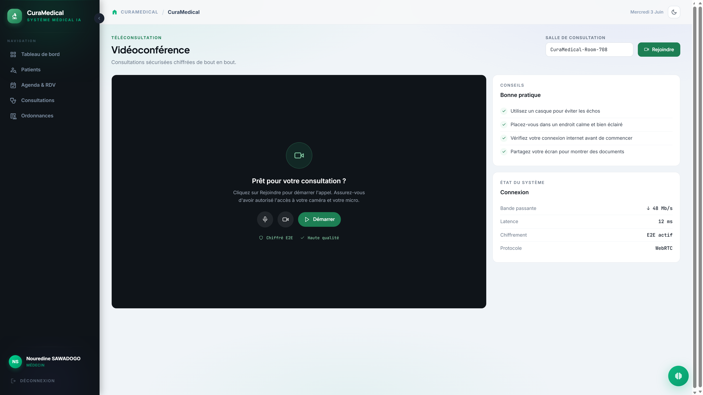
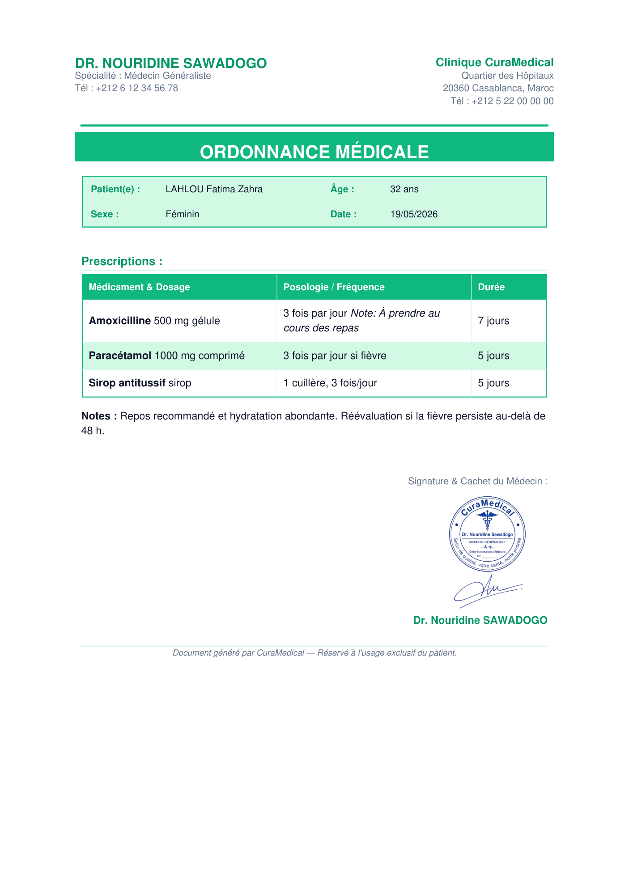
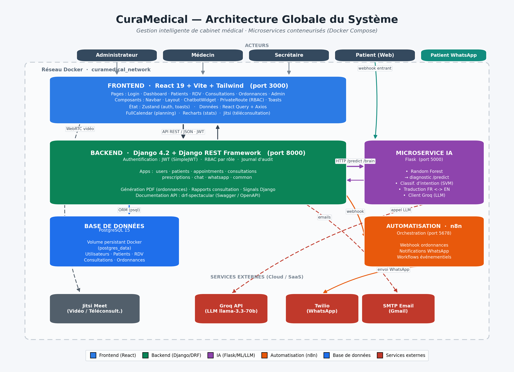

<div align="center">


# CuraMedical

### Plateforme web de gestion intelligente de cabinet médical, avec aide au diagnostic par intelligence artificielle

<p>
  
  
  
  
  
  
  
  
  
  
</p>

</div>

---

## 📖 À propos

**CuraMedical** est une application web complète qui digitalise le fonctionnement d'un cabinet médical : gestion des patients, des rendez-vous, des consultations et des ordonnances, **téléconsultation vidéo**, **chatbot** et **module d'aide au diagnostic basé sur le machine learning**.

L'architecture est **microservices** et entièrement **conteneurisée (Docker)** : une API REST Django, une interface React, un microservice IA en Flask, et des workflows d'automatisation n8n (rappels et notifications par e-mail / WhatsApp).

> 🎓 Projet académique réalisé dans le cadre du module **Projet en Systèmes Informatiques** — **ISGA**, filière 2CI-ISI (2025-2026).

---

## ✨ Fonctionnalités principales

| Domaine | Description |
|---|---|
| 🔐 **Authentification & rôles** | JWT (access 8 h + refresh 7 j, rotation), **4 rôles** : Administrateur, Médecin, Secrétaire, Patient — avec contrôle d'accès strict par endpoint |
| 👥 **Gestion des patients** | Dossier médical complet (antécédents, allergies, groupe sanguin), recherche multi-champs, archivage (soft delete), calcul d'âge automatique |
| 📅 **Rendez-vous** | Vue calendrier (FullCalendar) et liste, anti-conflit horaire, workflow de statuts, présentiel ou en ligne |
| 🩺 **Consultations** | Saisie des symptômes par tags, diagnostic, génération de **compte rendu PDF** |
| 🤖 **Aide au diagnostic (IA)** | Microservice Flask + scikit-learn : à partir des symptômes, renvoie le **Top 3 des pathologies** avec score de confiance |
| 💬 **Chatbot médical** | Assistant conversationnel (classification d'intentions + moteur de raisonnement) pour interroger l'activité du cabinet |
| 📹 **Téléconsultation** | Visioconférence intégrée (Jitsi Meet), salle unique par rendez-vous, panneau de saisie en temps réel |
| 💊 **Ordonnances** | Prescriptions multi-médicaments, export **PDF** avec cachet et signature |
| 🔔 **Notifications** | E-mails automatiques (confirmation de RDV), rappel 24 h et « ordonnance disponible » via **n8n**, notifications **WhatsApp** (Twilio) |
| 📊 **Tableaux de bord** | KPIs et statistiques par rôle (top pathologies, taux d'utilisation de l'IA, RDV honorés/annulés) |
| 🛡️ **Audit & sécurité** | Journal d'audit complet (django-auditlog) sur les entités sensibles, documentation API (Swagger / OpenAPI) |

---

## 🖼️ Aperçu

<table>
  <tr>
    <td width="50%"><br/><sub><b>Page d'accueil</b></sub></td>
    <td width="50%"><br/><sub><b>Tableau de bord médecin</b></sub></td>
  </tr>
  <tr>
    <td width="50%"><br/><sub><b>Consultation — analyse IA des symptômes</b></sub></td>
    <td width="50%"><br/><sub><b>Chatbot médical</b></sub></td>
  </tr>
  <tr>
    <td width="50%"><br/><sub><b>Téléconsultation vidéo (Jitsi)</b></sub></td>
    <td width="50%"><br/><sub><b>Ordonnance générée en PDF</b></sub></td>
  </tr>
</table>

---

## 🏗️ Architecture

<div align="center">
  
</div>

| Service | Technologie | Rôle | Port |
|---|---|---|---|
| **frontend** | React 19 + Vite + Tailwind CSS | Interface utilisateur (SPA) | `3000` |
| **backend** | Django 4.2 + Django REST Framework | API REST, métier, authentification JWT | `8000` |
| **ia-service** | Flask + scikit-learn | Microservice d'aide au diagnostic & chatbot | `5000` |
| **db** | PostgreSQL 15 | Base de données relationnelle | — |
| **redis** + **celery** | Redis 7 + Celery | File de tâches asynchrones (notifications, PDF) | — |
| **n8n** | n8n | Automatisation (rappels, webhooks) | `5678` |
| **ngrok** | ngrok | Tunnel HTTPS public (webhooks Twilio/WhatsApp) | `4040` |

---

## 🧰 Stack technique

- **Backend** — Django 4.2, Django REST Framework, SimpleJWT, django-filter, drf-spectacular, django-auditlog, ReportLab (PDF), Celery
- **Frontend** — React 19, React Router 7, Zustand, TanStack Query, Recharts, FullCalendar, Jitsi React SDK, Tailwind CSS 4, Vite
- **IA** — Python, Flask, scikit-learn (Random Forest), classification d'intentions + moteur de raisonnement
- **Données & infra** — PostgreSQL 15, Redis 7, Docker & Docker Compose
- **Intégrations** — n8n (automatisation), Twilio (WhatsApp), Jitsi Meet (visio), SMTP (e-mails)

---

## 🚀 Démarrage rapide (Docker)

> **Prérequis :** [Docker Desktop](https://www.docker.com/products/docker-desktop/) et Git.

```bash
# 1. Cloner le dépôt
git clone https://github.com/Abdou-SALOU/curamedical.git
cd curamedical

# 2. Créer le fichier d'environnement à partir du modèle
cp .env.example .env
#   → renseigner au minimum SECRET_KEY (les autres clés ont des valeurs par défaut
#     pour le développement local ; les intégrations Twilio/Groq/ngrok sont optionnelles)

# 3. Lancer toute la stack
docker compose up --build
```

Au premier démarrage, le backend **applique automatiquement les migrations** et **crée les comptes de démonstration** (voir ci-dessous).

### 🌐 Accès aux services

| Service | URL |
|---|---|
| Frontend | http://localhost:3000 |
| API REST | http://localhost:8000/api |
| Documentation API (Swagger) | http://localhost:8000/api/docs |
| Admin Django | http://localhost:8000/admin |
| Microservice IA | http://localhost:5000 |
| n8n | http://localhost:5678 |

### 👤 Comptes de démonstration

> Comptes locaux créés automatiquement au démarrage — **à usage de démonstration uniquement**.

| Rôle | Identifiant | Mot de passe |
|---|---|---|
| Administrateur | `admin` | `adminpassword` |
| Médecin | `medecin` | `medecinpassword` |
| Secrétaire | `secretaire` | `secretairepassword` |
| Patient | *via le formulaire d'inscription* | — |

---

## 📁 Structure du projet

```
curamedical/
├── backend/                 # API Django + DRF
│   ├── apps/
│   │   ├── users/           #   Authentification, rôles, permissions
│   │   ├── patients/        #   Dossiers patients
│   │   ├── appointments/    #   Rendez-vous
│   │   ├── consultations/   #   Consultations + compte rendu PDF
│   │   ├── prescriptions/   #   Ordonnances + PDF
│   │   ├── chat/            #   Chatbot médical
│   │   ├── whatsapp/        #   Notifications WhatsApp (Twilio)
│   │   └── common/          #   Utilitaires partagés (PDF, signature…)
│   └── curamedical/         #   Configuration du projet Django
├── frontend/                # Application React (Vite + Tailwind)
│   └── src/                 #   pages, components, store, api…
├── ia-service/              # Microservice IA (Flask + scikit-learn)
│   ├── app.py               #   API du service
│   ├── train.py             #   Entraînement du modèle
│   ├── intent_classifier.py #   Classification d'intentions (chatbot)
│   └── reasoning_engine.py  #   Moteur de raisonnement
├── n8n/                     # Workflows d'automatisation (JSON)
├── soutenance/              # Rapport, présentation, diagrammes UML, captures
├── docker-compose.yml
└── .env.example
```

---

## 👥 Équipe & encadrement

Projet réalisé en équipe à l'**ISGA** (filière 2CI-ISI, 2025-2026).

- **Abdou SALOU ABDOU** — [@Abdou-SALOU](https://github.com/Abdou-SALOU)
- **Kamara MACIRE**
- **Nouridine SAWADOGO**

**Encadrante :** Dr. Soumia CHOKRI

---

## ⚠️ Avertissement

Le module d'intelligence artificielle est un **outil d'aide à la décision**. Il **ne remplace en aucun cas** le diagnostic d'un professionnel de santé. Ce projet a été développé à des fins **pédagogiques et de démonstration**.

---

<div align="center">
<sub>© 2025-2026 — Projet académique CuraMedical · ISGA</sub>
</div>
